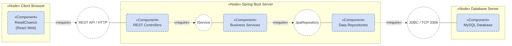

```mermaid
flowchart LR
    %% Định dạng màu sắc mô phỏng UML
    classDef component fill:#d4e1f9,stroke:#2b5e8c,stroke-width:1.5px,rx:5px,ry:5px;
    classDef node fill:#f8f9fa,stroke:#666,stroke-width:2px,stroke-dasharray: 4 4;
    classDef interface fill:#fff,stroke:#000,stroke-width:1px;

    %% Client Node
    subgraph Client ["«Node» Client Browser"]
        direction TB
        UI["«Component»\nRetailChainUi\n(React Web)"]:::component
    end

    %% Server Node
    subgraph Server ["«Node» Spring Boot Server"]
        direction TB
        Ctrl["«Component»\nREST Controllers"]:::component
        Serv["«Component»\nBusiness Services"]:::component
        Repo["«Component»\nData Repositories"]:::component
        
        %% Internal Interfaces
        IServ(("IService")):::interface
        IRepo(("JpaRepository")):::interface
    end

    %% Database Node
    subgraph DBNode ["«Node» Database Server"]
        direction TB
        DB["«Component»\nMySQL Database"]:::component
    end

    %% External Interfaces
    IRest(("REST API / HTTP")):::interface
    IJDBC(("JDBC / TCP 3306")):::interface

    %% Kết nối (Dependencies & Provided Interfaces)
    UI -. "«require»" .-> IRest
    IRest --- Ctrl

    Ctrl -. "«require»" .-> IServ
    IServ --- Serv

    Serv -. "«require»" .-> IRepo
    IRepo --- Repo

    Repo -. "«require»" .-> IJDBC
    IJDBC --- DB
```