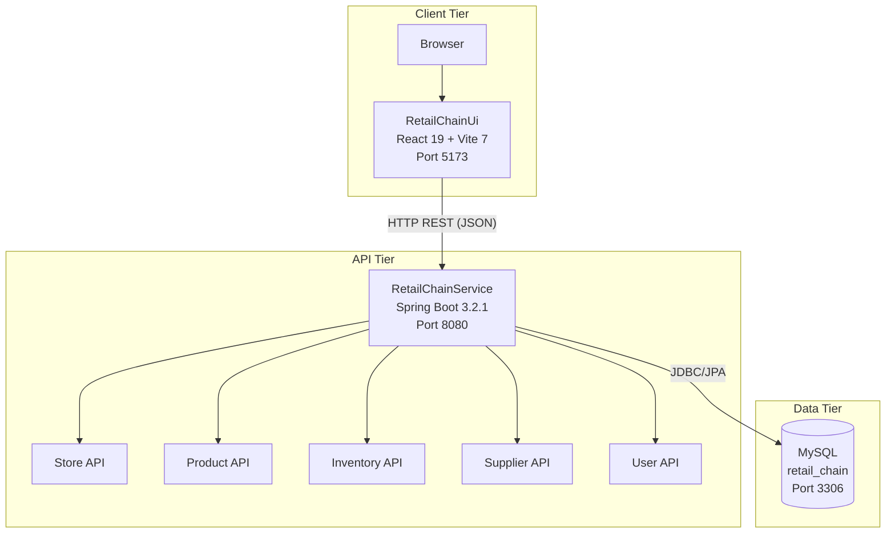
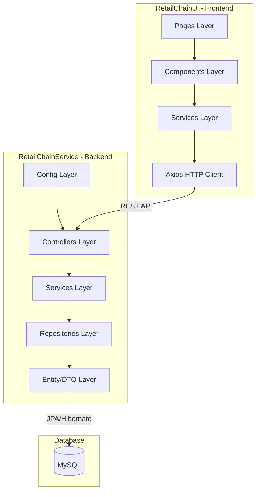
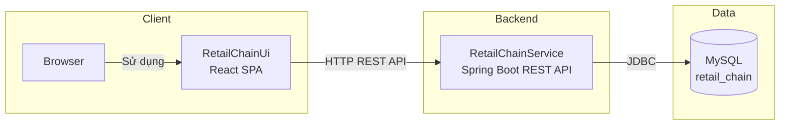
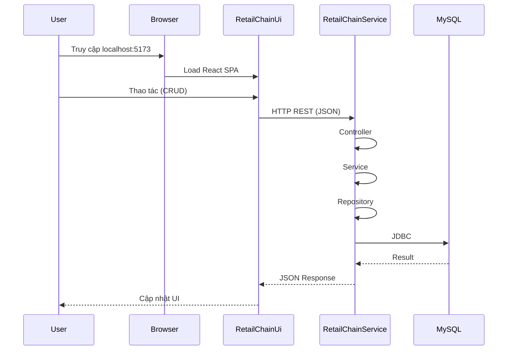

# Retail Chain Management - Kiến trúc Hệ thống

Tài liệu mô tả **System Architecture** và **Software Architecture** của dự án Retail Chain Management (RCM).

---

## 1. System Architecture (Kiến trúc Hệ thống)

### 1.1 Tổng quan hệ thống

```
┌─────────────────────────────────────────────────────────────────────────────────────────────────┐
│                           RETAIL CHAIN MANAGEMENT - SYSTEM ARCHITECTURE                           │
└─────────────────────────────────────────────────────────────────────────────────────────────────┘

                                    ┌───────────────────────┐
                                    │        BROWSER         │
                                    │   (User Interface)     │
                                    └───────────┬───────────┘
                                                │
                                    HTTP/HTTPS  │  REST API
                                    localhost:5173
                                                │
                                                ▼
┌─────────────────────────────────────────────────────────────────────────────────────────────────┐
│  CLIENT TIER                          │  RetailChainUi (Frontend)                                │
│  ────────────────────────────────────│  Port: 5173 (Vite Dev)                                   │
│  • React 19 + Vite 7                 │  • Pages (Dashboard, Store, Product, Inventory...)        │
│  • Tailwind CSS 4                    │  • Components (Layout, UI, Radix)                         │
│  • TanStack Table, Leaflet           │  • Services (store, product, inventory, dashboard...)     │
│  • React Router 7                    │  • Axios HTTP Client                                      │
└──────────────────────────────────────┼─────────────────────────────────────────────────────────┘
                                       │
                                       │  CORS: localhost:5173
                                       │  Base URL: http://localhost:8080/retail-chain/api
                                       │
                                       ▼
┌─────────────────────────────────────────────────────────────────────────────────────────────────┐
│  API TIER                            │  RetailChainService (Backend)                             │
│  ───────────────────────────────────│  Port: 8080, Context: /retail-chain                        │
│  • Java 17 + Spring Boot 3.2.1       │                                                           │
│  • REST Controllers                  │  • StoreController      /api/stores                       │
│  • Spring Web, Validation            │  • ProductController    /api/product                      │
│  • springdoc-openapi (Swagger)       │  • InventoryController  /api/inventory                    │
│  • Spring Mail                       │  • InventoryHistoryController  /api/inventory-history     │
│                                      │  • SupplierController   /api/supplier                     │
│                                      │  • UserController       /api/user                         │
│  Swagger UI: /retail-chain/swagger-ui.html                                                       │
│  API Docs:   /retail-chain/v3/api-docs                                                           │
└──────────────────────────────────────┼─────────────────────────────────────────────────────────┘
                                       │
                                       │  JDBC
                                       │
                                       ▼
┌─────────────────────────────────────────────────────────────────────────────────────────────────┐
│  DATA TIER                           │  MySQL Database                                           │
│  ───────────────────────────────────│  Database: retail_chain                                    │
│  • MySQL (JDBC Driver)               │                                                           │
│  • Hibernate JPA (ddl-auto: update)  │  Tables: stores, warehouses, store_warehouses,            │
│                                      │           products, product_variants, product_categories,  │
│                                      │           inventory_stock, inventory_document,             │
│                                      │           inventory_document_item, inventory_history,      │
│                                      │           users, roles, user_roles, suppliers,             │
│                                      │           shifts, shift_assignments, attendance_logs       │
└─────────────────────────────────────────────────────────────────────────────────────────────────┘
```

### 1.2 Sơ đồ luồng dữ liệu (Data Flow)

```
┌──────────────┐      HTTP REST       ┌──────────────────────┐      JDBC/JPA      ┌──────────────┐
│   User       │ ──────────────────▶  │  RetailChainUi       │                     │              │
│   (Browser)  │ ◀──────────────────  │  React SPA           │                     │              │
└──────────────┘   JSON Response      │                      │                     │              │
                     Axios Client     │  /store, /products   │                     │   MySQL      │
                                     │  /inventory, /staff  │  ────────────────▶  │   Database   │
                                     │                      │ ◀────────────────    │              │
                                     │                      │                     │              │
                                     └──────────┬───────────┘                     └──────────────┘
                                                │
                                                │  POST/GET/PUT/DELETE
                                                │  Content-Type: application/json
                                                │
                                                ▼
                                     ┌──────────────────────┐
                                     │  RetailChainService  │
                                     │  Spring Boot REST    │
                                     │                      │
                                     │  Controllers ──────▶ Services ──────▶ Repositories
                                     │      │                    │                │
                                     │      └────────────────────┴────────────────┘
                                     │                         Entity ↔ DTO
                                     └───────────────────────────────────────────
```

### 1.3 Deployment Architecture

```
┌─────────────────────────────────────────────────────────────────────────────────┐
│                        DEVELOPMENT / DEPLOYMENT VIEW                              │
└─────────────────────────────────────────────────────────────────────────────────┘

  ┌─────────────────┐                    ┌─────────────────┐                    ┌─────────────────┐
  │   localhost     │                    │   localhost     │                    │   MySQL         │
  │   :5173         │   ─────────────▶   │   :8080         │   ─────────────▶   │   :3306         │
  │                 │   CORS Allowed     │                 │   JDBC             │                 │
  │  npm run dev    │                    │  mvn spring-    │                    │  retail_chain   │
  │  (Vite)         │                    │  boot:run       │                    │                 │
  └─────────────────┘                    └─────────────────┘                    └─────────────────┘
         Frontend                              Backend                              Database
```

---

## 2. Software Architecture (Kiến trúc Phần mềm)

### 2.1 Kiến trúc phân lớp (Layered Architecture)

```
┌─────────────────────────────────────────────────────────────────────────────────────────────────┐
│                    RETAIL CHAIN MANAGEMENT - SOFTWARE ARCHITECTURE                                │
│                              (Layered / N-Tier Architecture)                                      │
└─────────────────────────────────────────────────────────────────────────────────────────────────┘

╔═════════════════════════════════════════════════════════════════════════════════════════════════╗
║  FRONTEND (RetailChainUi)                                                                       ║
╠═════════════════════════════════════════════════════════════════════════════════════════════════╣
║                                                                                                 ║
║  ┌─────────────────────────────────────────────────────────────────────────────────────────┐   ║
║  │  PRESENTATION LAYER                                                                      │   ║
║  │  src/pages/                                                                              │   ║
║  │  • DashboardPage, StorePage, ProductPage, InventoryPage                                  │   ║
║  │  • StoreDashboardPage, StockInList, StockOutList, StaffList, WarehouseListPage           │   ║
║  │  • ExecutiveReport, StaffCalendar, StaffAttendance, StaffProfile, ResourceAssignment     │   ║
║  └──────────────────────────────────────────┬──────────────────────────────────────────────┘   ║
║                                             │                                                   ║
║  ┌──────────────────────────────────────────▼──────────────────────────────────────────────┐   ║
║  │  COMPONENT LAYER                                                                         │   ║
║  │  src/components/                                                                         │   ║
║  │  • MainLayout, Header, Sidebar, Footer                                                   │   ║
║  │  • UI Components (Radix: Dialog, Dropdown, Select, Avatar...)                            │   ║
║  │  • Feature Components (DataTable, Forms, Charts)                                         │   ║
║  └──────────────────────────────────────────┬──────────────────────────────────────────────┘   ║
║                                             │                                                   ║
║  ┌──────────────────────────────────────────▼──────────────────────────────────────────────┐   ║
║  │  STATE & ROUTING                                                                         │   ║
║  │  src/context/AuthContext.jsx  |  src/routes/AppRoutes.jsx  |  src/hooks/useGeoLocation    │   ║
║  └──────────────────────────────────────────┬──────────────────────────────────────────────┘   ║
║                                             │                                                   ║
║  ┌──────────────────────────────────────────▼──────────────────────────────────────────────┐   ║
║  │  SERVICE LAYER                                                                           │   ║
║  │  src/services/                                                                           │   ║
║  │  • store.service.js, product.service.js, inventory.service.js                            │   ║
║  │  • dashboard.service.js, staff.service.js, supplier.service.js                           │   ║
║  └──────────────────────────────────────────┬──────────────────────────────────────────────┘   ║
║                                             │                                                   ║
║  ┌──────────────────────────────────────────▼──────────────────────────────────────────────┐   ║
║  │  HTTP CLIENT                                                                             │   ║
║  │  src/services/api/axiosClient.js                                                         │   ║
║  │  • axiosPublic, axiosPrivate (base: /retail-chain/api)                                   │   ║
║  └─────────────────────────────────────────────────────────────────────────────────────────┘   ║
║                                                                                                 ║
╚═════════════════════════════════════════════════════════════════════════════════════════════════╝
                                                    │
                                                    │  HTTP REST (JSON)
                                                    ▼
╔═════════════════════════════════════════════════════════════════════════════════════════════════╗
║  BACKEND (RetailChainService)                                                                   ║
╠═════════════════════════════════════════════════════════════════════════════════════════════════╣
║                                                                                                 ║
║  ┌─────────────────────────────────────────────────────────────────────────────────────────┐   ║
║  │  CONFIGURATION LAYER                                                                     │   ║
║  │  config/                                                                                 │   ║
║  │  • WebConfig (CORS), OpenApiConfig, Config                                               │   ║
║  └──────────────────────────────────────────┬──────────────────────────────────────────────┘   ║
║                                             │                                                   ║
║  ┌──────────────────────────────────────────▼──────────────────────────────────────────────┐   ║
║  │  PRESENTATION / API LAYER (Controllers)                                                   │   ║
║  │  controller/                                                                             │   ║
║  │  • StoreController, ProductController, InventoryController                               │   ║
║  │  • InventoryHistoryController, SupplierController, UserController                        │   ║
║  └──────────────────────────────────────────┬──────────────────────────────────────────────┘   ║
║                                             │                                                   ║
║  ┌──────────────────────────────────────────▼──────────────────────────────────────────────┐   ║
║  │  BUSINESS LOGIC LAYER (Services)                                                          │   ║
║  │  service/ & service.impl/                                                                 │   ║
║  │  • StoreService, ProductService, InventoryService                                         │   ║
║  │  • InventoryHistoryService, SupplierService, UserService, MessageService                  │   ║
║  └──────────────────────────────────────────┬──────────────────────────────────────────────┘   ║
║                                             │                                                   ║
║  ┌──────────────────────────────────────────▼──────────────────────────────────────────────┐   ║
║  │  DATA ACCESS LAYER (Repositories)                                                         │   ║
║  │  repository/                                                                              │   ║
║  │  • StoreRepository, WarehouseRepository, ProductRepository                                │   ║
║  │  • ProductVariantRepository, InventoryStockRepository, InventoryDocumentRepository        │   ║
║  │  • InventoryDocumentItemRepository, InventoryHistoryRepository                            │   ║
║  │  • SupplierRepository, UserRepository                                                     │   ║
║  └──────────────────────────────────────────┬──────────────────────────────────────────────┘   ║
║                                             │                                                   ║
║  ┌──────────────────────────────────────────▼──────────────────────────────────────────────┐   ║
║  │  DOMAIN LAYER                                                                            │   ║
║  │  entity/ & dto/ & mapper/                                                                 │   ║
║  │  • Store, Warehouse, Product, ProductVariant, InventoryStock                             │   ║
║  │  • InventoryDocument, InventoryDocumentItem, InventoryHistory                             │   ║
║  │  • User, Role, Supplier, Shift, ShiftAssignment, AttendanceLog                            │   ║
║  │  • StoreMapper, DTO (request/response)                                                    │   ║
║  └─────────────────────────────────────────────────────────────────────────────────────────┘   ║
║                                                                                                 ║
╚═════════════════════════════════════════════════════════════════════════════════════════════════╝
                                                    │
                                                    │  JPA / Hibernate
                                                    ▼
╔═════════════════════════════════════════════════════════════════════════════════════════════════╗
║  PERSISTENCE (MySQL)                                                                            ║
║  retail_chain schema | Hibernate ddl-auto=update                                                ║
╚═════════════════════════════════════════════════════════════════════════════════════════════════╝
```

### 2.2 Component Diagram (Sơ đồ thành phần)

```
┌─────────────────────────────────────────────────────────────────────────────────────────────────┐
│                              COMPONENT RELATIONSHIPS                                              │
└─────────────────────────────────────────────────────────────────────────────────────────────────┘

  ┌─────────────┐
  │   Browser   │
  └──────┬──────┘
         │
         ▼
  ┌──────────────────────────────────────────────────────────────────────────────────────────────┐
  │                         RetailChainUi (SPA)                                                    │
  │  ┌────────────┐  ┌────────────┐  ┌────────────┐  ┌────────────┐  ┌────────────────────────┐  │
  │  │  AppRoutes │  │ AuthContext│  │  MainLayout│  │   Pages    │  │  Services              │  │
  │  └─────┬──────┘  └────────────┘  └─────┬──────┘  └─────┬──────┘  │ store, product,        │  │
  │        │                               │               │         │ inventory, dashboard   │  │
  │        └───────────────────────────────┼───────────────┘         │ staff, supplier        │  │
  │                                        │                         └───────────┬────────────┘  │
  │                                        │                                       │              │
  │                                        └───────────────────────────────────────┤              │
  │                                                                                │              │
  │  ┌─────────────────────────────────────────────────────────────────────────────▼────────────┐ │
  │  │                              axiosClient (HTTP)                                           │ │
  │  └─────────────────────────────────────────────────────────────────────────────────────────┘ │
  └────────────────────────────────────────────┬─────────────────────────────────────────────────┘
                                               │
                                               │ REST API
                                               ▼
  ┌──────────────────────────────────────────────────────────────────────────────────────────────┐
  │                         RetailChainService                                                    │
  │  ┌─────────────────────────────────────────────────────────────────────────────────────────┐ │
  │  │  Controllers                                                                            │ │
  │  │  StoreController ──▶ StoreService ──▶ StoreRepository ──▶ Store (Entity)                │ │
  │  │  ProductController ──▶ ProductService ──▶ ProductRepository ──▶ Product, ProductVariant │ │
  │  │  InventoryController ──▶ InventoryService ──▶ WarehouseRepo, InventoryStockRepo, ...    │ │
  │  │  InventoryHistoryController ──▶ InventoryHistoryService ──▶ InventoryHistoryRepository  │ │
  │  │  SupplierController ──▶ SupplierService ──▶ SupplierRepository                          │ │
  │  │  UserController ──▶ UserService ──▶ UserRepository                                      │ │
  │  └─────────────────────────────────────────────────────────────────────────────────────────┘ │
  │                                                                                              │
  │  ┌─────────────┐  ┌──────────────┐  ┌───────────────┐                                       │
  │  │ WebConfig   │  │ OpenApiConfig│  │ Exception     │                                       │
  │  │ (CORS)      │  │ (Swagger)    │  │ Handler       │                                       │
  │  └─────────────┘  └──────────────┘  └───────────────┘                                       │
  └────────────────────────────────────────────┬─────────────────────────────────────────────────┘
                                               │
                                               │ JDBC
                                               ▼
  ┌──────────────────────────────────────────────────────────────────────────────────────────────┐
  │  MySQL (retail_chain)                                                                        │
  │  stores | warehouses | store_warehouses | products | product_variants | inventory_* | users  │
  └──────────────────────────────────────────────────────────────────────────────────────────────┘
```

### 2.3 Module Dependencies (Backend)

```
┌─────────────────────────────────────────────────────────────────────────────────┐
│                    BACKEND MODULE DEPENDENCIES                                    │
└─────────────────────────────────────────────────────────────────────────────────┘

  controller  ────────▶  service  ────────▶  repository
      │                      │                     │
      │                      │                     │
      ▼                      ▼                     ▼
  dto/request           dto/response           entity
  dto/response          mapper
  exception
```

---

## 3. Technology Stack Summary

| Layer | Technology | Version |
|-------|------------|---------|
| **Frontend** | React | 19.2.0 |
| | Vite | 7.2.4 |
| | Tailwind CSS | 4.x |
| | Radix UI | Latest |
| | TanStack Table | 8.x |
| | React Router | 7.x |
| | Axios | 1.13.x |
| | Leaflet / react-leaflet | 1.9 / 5.0 |
| **Backend** | Java | 17 |
| | Spring Boot | 3.2.1 |
| | Spring Data JPA | (included) |
| | Spring Web | (included) |
| | Spring Mail | (included) |
| | springdoc-openapi | 2.3.0 |
| | Lombok, Gson | - |
| **Database** | MySQL | - |
| | Hibernate | (via Spring) |

---

## 4. API Endpoints Summary

| Module | Method | Endpoint | Description |
|--------|--------|----------|-------------|
| **Store** | GET | `/api/stores` | Danh sách cửa hàng |
| | GET | `/api/stores/{slug}` | Chi tiết cửa hàng |
| | POST | `/api/stores` | Tạo cửa hàng |
| | PUT | `/api/stores/{slug}` | Cập nhật cửa hàng |
| | GET | `/api/stores/{id}/staff` | Nhân viên cửa hàng |
| **Product** | GET | `/api/product` | Danh sách sản phẩm |
| | GET | `/api/product/{id}` | Chi tiết sản phẩm |
| | POST | `/api/product` | Tạo sản phẩm |
| | PUT | `/api/product/{id}` | Cập nhật sản phẩm |
| | DELETE | `/api/product/{id}` | Xóa sản phẩm |
| **Inventory** | GET | `/api/inventory/warehouse` | Danh sách kho |
| | POST | `/api/inventory/warehouse` | Tạo kho |
| | GET | `/api/inventory/stock/{warehouseId}` | Tồn kho theo kho |
| | POST | `/api/inventory/import` | Nhập kho |
| | POST | `/api/inventory/export` | Xuất kho |
| | POST | `/api/inventory/transfer` | Chuyển kho |
| | GET | `/api/inventory/documents?type=` | Danh sách phiếu |
| **Inventory History** | GET | `/api/inventory-history/record` | Lịch sử tồn kho |
| | POST | `/api/inventory-history/record/add` | Ghi nhận thay đổi |
| **Supplier** | GET | `/api/supplier` | Danh sách nhà cung cấp |
| **User** | GET | `/api/user/profile/{id}` | Thông tin user |

---

---

## 5. Sơ đồ Mermaid (Render trên GitHub / VS Code)

### 5.1 System Architecture - Mermaid



### 5.2 Software Architecture - Layered Mermaid



### 5.3 Component Diagram - Mermaid



### 5.4 Data Flow - Mermaid



---

*Tài liệu được tạo từ phân tích dự án Retail Chain Management*
